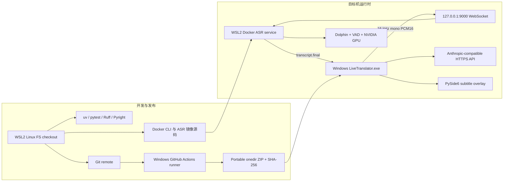

# Live Translator V2 实施方案

状态：V2 替换分支和客户端迁移代码已准备，实际 WSL 迁移、ASR 服务与目标 GPU 验证未完成
更新日期：2026-08-21
用途：个人自用
目标设备：Windows 11、NVIDIA GPU、8GB 显存
语言方向：日语语音到简体中文字幕

## 1. 结论

项目采用一份 WSL2 checkout、一个 Windows 便携客户端和一个 WSL2 Docker ASR 服务。

源码、Git、uv、Python、Codex、Claude Code 和 Docker CLI 全部在 WSL2 的 Linux 文件系统中使用。Windows 物理机不承担开发，不安装 Python、uv 或 Conda。Windows 客户端由 GitHub Actions 的 Windows runner 构建为 PyInstaller onedir ZIP，目标机只下载并运行该产物。

“全部在 WSL”只适用于开发环境。运行时不能合并成单个 Linux 进程，因为 WASAPI loopback 和 PySide6 桌面窗口必须运行在 Windows。Windows 与 ASR 容器通过 localhost WebSocket 交换音频和识别事件，不共享音频文件。

## 2. 固定选择

| 项目 | 决定 |
| --- | --- |
| 开发 checkout | WSL2 Linux 文件系统中的单份仓库 |
| 开发工具 | WSL shell 中的 Git、uv、Python、Codex 或 Claude Code |
| Windows 发布形式 | Windows CI 构建的 PyInstaller onedir ZIP |
| Windows 客户端 | Python 3.12、PySide6 |
| 系统音频 | WASAPI loopback、PyAudioWPatch、soxr |
| ASR | `DataoceanAI/dolphin-small` |
| ASR 运行位置 | Docker Desktop 的 WSL2 backend |
| GPU | NVIDIA，目标显存 8GB |
| ASR 通信 | `127.0.0.1` 上的 HTTP 和 WebSocket |
| 翻译 | 用户自建的 Anthropic Messages API 兼容接口 |
| 字幕 | 日文 final 加简体中文译文，不做 partial |
| 密钥位置 | `%LOCALAPPDATA%\LiveTranslator\.env` |

不再保留 Windows 源码 checkout、Windows Python 开发环境、WSL 与 Windows 双 checkout、anime-whisper、OpenAI Chat Completions 或旧 TypeScript 主线。

## 3. 开发与运行结构



模型权重和容器持久数据放进 Docker named volume。源码、模型和音频都不从 Windows 盘 bind mount 到容器。翻译 API key 不进入 WSL 或 Docker。

## 4. MVP 范围

MVP 包含：

- 采集 Windows 当前输出设备的系统混音。
- 转换为 16 kHz、单声道、PCM16，并按 100 ms 分帧。
- 通过 localhost WebSocket 持续发送音频。
- 用流式 VAD 形成语句，每个语句调用一次 Dolphin。
- 在停止前持续返回日文 final。
- 调用 Anthropic-compatible API，并显示日文和中文。
- 提供控制窗、置顶字幕窗、设备选择和降级状态。
- 使用有界队列、确定超时、停止确认和资源清理。
- 保存脱敏轮转日志以及延迟、过载和显存测量。
- 在无 Python 的干净 Windows 11 环境运行 CI 产物。

MVP 不包含：

- CPU ASR、云端 ASR 或第二套模型。
- 原生 Windows ASR 进程。
- partial、逐词字幕或滚动重解码。
- 浏览器扩展、OBS 插件、TTS、说话人分离或人声分离。
- 自动安装 WSL2、Docker Desktop、驱动或模型。
- 安装器、自动更新、多用户部署和复杂密钥管理。
- 多语言切换、字幕历史、导出或术语表编辑器。

## 5. Windows 客户端

Windows 客户端负责：

- 枚举并采集 WASAPI loopback 设备。
- 在非回调线程中混音、重采样和生成固定 PCM 帧。
- 探测 ASR ready、维持 WebSocket、发送音频并独立接收事件。
- 过滤错误 session、重复 seq 和倒退 seq。
- 调用翻译 API，维护最多两条已确认上下文。
- 在翻译失败时保留日文并继续 ASR。
- 把状态交给 PySide6 控制窗和字幕窗。
- 在 `%LOCALAPPDATA%\LiveTranslator\logs` 写脱敏轮转日志。

音频回调、重采样、网络和 GUI 分属不同线程或异步任务。输入队列、输出队列、ASR 事件队列和翻译队列都有容量上限。停止采集后先排空捕获缓冲和重采样尾帧，再发送 `stream.stop`。

字幕只显示 final。最多保留当前句和上一句。迟到翻译只能更新发起该请求的 segment，不能把窗口退回旧句。

## 6. Windows 便携发布包

发布包由 Windows GitHub Actions runner 构建，不能从 WSL 交叉编译。构建流程：

1. 按 `uv.lock` 安装 Python 3.12、开发依赖和 package 依赖。
2. 运行完整测试、Ruff、Pyright 和仓库安全检查。
3. 用 `windows-client/packaging/live-translator.spec` 构建 onedir 目录。
4. 复制配置模板、客户端 README 和 `configure.ps1`。
5. 检查 EXE、Qt platform plugin、PyAudioWPatch、soxr 和 certifi CA bundle。
6. 拒绝 `.env`、`config.toml`、私钥、额外 PEM 和模型文件。
7. 执行冻结 EXE 的 `--self-test`。
8. 生成 ZIP 和 SHA-256 文件，并上传 CI artifact。

目标 Windows 设备不运行 uv。用户下载 ZIP 后校验哈希、解压、运行 `configure.ps1`，再编辑 `%LOCALAPPDATA%\LiveTranslator\config.toml` 和 `.env`。

## 7. 音频合同

| 字段 | 值 |
| --- | --- |
| sample rate | `16000` |
| channels | `1` |
| encoding | `pcm_s16le` |
| chunk duration | `100 ms` |
| chunk size | `3200 bytes` |
| language | `ja` |

`stream.ready` 之后，每个音频 WebSocket message 都是 3200 字节二进制数据，不使用 JSON 或 base64。短尾帧在停止时补零到 3200 字节。

## 8. ASR WebSocket 合同

默认端点：

- `GET http://127.0.0.1:9000/health`
- `GET http://127.0.0.1:9000/ready`
- `WS ws://127.0.0.1:9000/v1/asr`

客户端控制帧：

```json
{"type":"stream.start","session_id":"uuid","sample_rate":16000,"channels":1,"encoding":"pcm_s16le","language":"ja"}
{"type":"stream.stop","session_id":"uuid"}
```

服务事件：

```json
{"type":"stream.ready","session_id":"uuid"}
{"type":"transcript.final","session_id":"uuid","seq":1,"text":"今日はこのゲームをやります","audio_start_ms":0,"audio_end_ms":3280,"decode_ms":310}
{"type":"runtime.overloaded","session_id":"uuid","dropped_audio_ms":1200}
{"type":"stream.stopped","session_id":"uuid"}
{"type":"error","session_id":"uuid","code":"runtime_unavailable","message":"ASR service is not ready.","retryable":true}
```

`contracts/asr-v1.schema.json` 和 `contracts/asr-v1.examples.json` 是两侧共享事实来源。协议不接受未知字段，不定义 partial。`stream.start` 和 `stream.stop` 的确认由独立生命周期 waiter 处理，不能被字幕事件队列阻塞。

## 9. ASR 服务设计

ASR 服务尚未实现。只有目标 WSL2 设备的 Docker 容器确认可见 NVIDIA GPU 后才创建 `asr-service/` 和 Compose。

服务固定提供一个模型实例、一个推理 worker 和有界队列。模型在进程启动时加载并 warm-up，`/ready` 只有在模型和推理 worker 可用后才返回 ready。客户端连接不能重复加载模型。

Dolphin-small 按 VAD 完整语句解码。第一版不对同一段音频滚动重解码。VAD 初始参数如下，实际值必须用用户音频调试：

| 参数 | 初始值 |
| --- | --- |
| VAD 内部帧 | 32 ms |
| 语音前缓存 | 400 ms |
| 语音结束静音 | 700 ms |
| 语音后缓冲 | 200 ms |
| 最短语音 | 240 ms |
| 强制切段 | 12 s |
| 强制切段重叠 | 800 ms |

前缓存不能省略。旧实验出现过首音节被截断。强制切段去重必须先用音频时间定位重叠，再对规范化文本做最长后缀和前缀匹配，不能只判断整段文本是否互为子串。

收到 `stream.stop` 后，服务应封口尚未结束的语音、排空当前 session 的推理任务、发送剩余 final，再发送 `stream.stopped`。服务端 traceback 只写容器日志，WebSocket 只返回稳定错误。

Compose 只映射 `127.0.0.1:9000:9000`，配置 NVIDIA GPU reservation、健康检查和模型 named volume。容器不接收翻译 API key，不使用 Windows bind mount，不复制旧仓库的 CUDA ABI 符号链接补丁。

## 10. 翻译接口

翻译请求固定使用 Anthropic Messages 风格：

```http
POST {configured endpoint}
content-type: application/json
x-api-key: {api_key}
anthropic-version: 2023-06-01
```

请求体包含 `model`、`max_tokens`、顶层 `system` 和 `messages`。响应拼接 `content` 中所有 `type == "text"` 的 block。不使用 messages 内的 system role，不使用 OpenAI Chat Completions，不做 token streaming，也不为格式修复发送第二次请求。

远程 endpoint 只允许 HTTPS，HTTP 只允许 loopback。客户端禁用自动重定向和环境代理。翻译队列默认容量为 2，满时丢弃最旧的待翻译字幕并显示降级状态。

## 11. 配置、安全和日志

Windows 本地文件：

```text
%LOCALAPPDATA%\LiveTranslator\config.toml
%LOCALAPPDATA%\LiveTranslator\.env
%LOCALAPPDATA%\LiveTranslator\logs\live-translator.log
```

API key 可以由进程环境变量覆盖，但默认持久化位置只有 `%LOCALAPPDATA%\LiveTranslator\.env`。`configure.ps1` 为当前 Windows 用户创建受保护 ACL。只要该文件存在，应用启动时就会检查 ACL，检查失败或权限过宽会显示警告。

真实 key 不得进入仓库、构建产物、异常消息、UI 或容器。配置对象的 repr 隐藏 key。诊断日志按大小轮转，替换已知 key 和 API header 值，不记录 HTTP header 或 body。

示例配置使用 `.invalid` endpoint、占位模型和 `replace-me` key。应用在网络请求前拒绝这些占位值。

## 12. 仓库结构

当前结构：

```text
live-translator/
├── .github/workflows/ci.yml
├── contracts/
├── scripts/
├── windows-client/
├── AGENTS.md
├── LIVE_TRANSLATOR_V2_PLAN.md
├── README.md
├── SECURITY.md
└── Transfer/                 本机旧资料，根仓库排除
```

GPU 探针通过后才增加：

```text
asr-service/
compose.yaml
```

`Transfer/` 不参加新项目的 Git、测试、扫描或审查。

## 13. 当前实现状态

已实现并通过自动化源码检查：

- Windows 客户端工程、锁文件和 WSL 检查脚本。
- 固定音频模型、soxr 重采样、100 ms 分帧和尾帧排空。
- ASR 协议模型、严格解析、共享 Schema、fake client 和 mock WebSocket 合同测试。
- 独立接收、生命周期确认、session/seq 过滤、过载和断线状态。
- Anthropic-compatible 翻译客户端、HTTPS/loopback 限制和 mock HTTP 测试。
- 会话控制器、有界翻译队列、字幕状态、控制窗和 overlay。
- `%LOCALAPPDATA%` 配置、严格字段、占位配置拒绝和脱敏轮转日志。
- `Transfer/` 排除、仓库敏感文件扫描、LF/CRLF 规则和根 pytest 隔离。
- Windows PyInstaller onedir 构建、冻结应用自检、运行时文件审计和 SHA-256 生成。
- Windows PowerShell 5.1 配置脚本及 `.env` ACL 创建、启动复查路径。

2026-07-31 在当前 Windows 迁移暂存机上的验证结果：

- 108 个测试通过，Ruff 检查和格式检查通过，Pyright strict 为 0 个错误。
- 锁文件离线检查、仓库敏感文件检查和源码 `--self-test` 通过。
- 本地便携包构建通过；冻结 EXE 分别使用 offscreen 和 Windows Qt platform 完成 `--self-test`。
- Windows PowerShell 5.1 配置和 ACL 测试通过，ZIP 内容与校验文件通过独立审计。

已实现但仍需 WSL、远程 CI 或干净目标机验证：

- WASAPI loopback 设备枚举和采集。
- 字体、拖动、透明度、置顶和全屏覆盖。
- `bash scripts/check.sh` 在真正的 WSL Linux checkout 中运行。
- GitHub Actions workflow 的首次远程 Linux 检查和 Windows artifact 构建。
- `.env` ACL 和便携包在无 Python 的干净 Windows 11 目标机上运行。

尚未实现或完成目标验证：

- `asr-service/`、Dolphin、VAD、Dockerfile 和 Compose。
- WSL2 Docker GPU 探针和真实模型加载。
- 8GB 显存、RTF、端到端延迟、两小时稳定性和游戏并行测试。
- 干净目标机上的 WASAPI、字体、拖动、透明度和全屏覆盖人工测试。
- 未签名 EXE 的下载、SmartScreen 提示和手动放行流程。
- V2 替换分支合并和首次远程 CI。

## 14. 后续实施顺序

### 阶段 A：完成远端迁移和发布基线

1. 审核 V2 替换分支，确认 `Transfer/`、本地配置、构建输出和秘密文件未被跟踪。
2. 合并到 `main` 并让首次远程 CI 完整运行。
3. 在 WSL Linux 文件系统重新 clone 根仓库。
4. 在 WSL 运行 `bash scripts/check.sh`。
5. 下载 Windows artifact，在无 Python 的 Windows 环境校验哈希并运行 `--self-test`。

退出条件：Linux job、Windows job、便携包检查和冻结 self-test 全部通过。

### 阶段 B：GPU 环境探针

1. 在目标 Windows 11 安装并更新 WSL2、Docker Desktop 和 NVIDIA 驱动。
2. 从 WSL shell 验证 Docker CLI、Compose 和 GPU 容器。
3. 在临时探针中加载 `dolphin-small`，使用固定日语 WAV warm-up 并推理十次。
4. 记录依赖版本、文本、RTF P50/P95、推理耗时和峰值显存。
5. 重启容器并证明 named volume 缓存复用。

退出条件：ASR 峰值显存不超过 4.5 GB，RTF P95 小于 0.5。未通过时先保留数据，不开始 GUI 联调。

### 阶段 C：ASR 服务

1. 实现 health、ready 和 `/v1/asr`。
2. 实现 PCM 校验、VAD、前缓存、尾缓冲、强制切段和重叠去重。
3. 实现单 worker 有界推理队列、overloaded 和稳定错误码。
4. 实现 stop 封口、排空和 `stream.stopped`。
5. 添加固定 WAV、长段、首音节、重叠、断线和停止合同测试。

### 阶段 D：真实链路

1. 用固定音频验证容器在 stop 前持续返回 final。
2. 用 Windows 便携客户端连接容器，先使用 mock 翻译。
3. 接入用户翻译 API。
4. 接入真实 WASAPI loopback 和字幕窗口。
5. 测试直播、视频和目标游戏音频。

### 阶段 E：目标验收

保存原始日志和测试样本，不用估算代替测量。

## 15. 验收条件

- Windows 11 目标机不安装 Python、uv 或 Conda，便携客户端可启动。
- Docker Desktop 使用 WSL2 backend，ASR 容器可见 NVIDIA GPU。
- ASR 容器峰值显存不超过 4.5 GB。
- 单段推理 RTF P95 小于 0.5。
- 说话结束到日文 final 的 P95 不超过 2.5 秒。
- 说话结束到中文字幕显示的 P95 不超过 6 秒。
- 连续运行两小时，Windows 客户端、容器内存和显存没有单调增长。
- 翻译 API 失败时日文继续更新，恢复后不补刷过时字幕。
- VAD 前缓存没有频繁吞掉首音节，强制切段没有大段重复或缺字。
- 与目标游戏同时运行时没有 OOM 或不可接受的卡顿。
- API key 不出现在 Git、artifact、WSL、容器、日志、UI 或测试输出。

## 16. 已知风险

### WSL2 和 Docker Desktop 状态

Docker Desktop 可能出现后端不可用、VHDX I/O 错误或容器异常退出。ready 探测必须区分 Docker 未启动、容器未启动、模型加载中和 runtime 失败。

### CUDA ABI

镜像、PyTorch 和宿主驱动必须按官方兼容关系固定。禁止复制旧方案中把不同 CUDA 主版本库名互相链接的做法。

### Dolphin 延迟

`dolphin-small` 在本方案中按 VAD 语句离线解码。若 700 ms 静音加解码仍不满足延迟，先保存测量数据，再评估官方 streaming checkpoint 是否支持日语。不要先实现滚动重解码。

### 8GB 显存竞争

ASR 单独达标不代表与游戏并行达标。最终验收必须包含目标游戏。先检查 tensor 生命周期和游戏显存设置，不增加第二套模型路径。

### 游戏音效干扰 VAD

Silero VAD 可能把配乐或效果音识别为语音。先调 threshold、前缓存、后缓冲和静音长度。人声分离不进入 MVP。

### 自建翻译 API

API 延迟和兼容程度不受客户端控制。客户端保留日文、限制队列、拒绝重定向，并让后续 final 继续流动。

### 未签名 Windows 产物

当前 PyInstaller 产物没有代码签名。浏览器的 Mark-of-the-Web 和 Windows SmartScreen 可能在首次运行时显示警告。先校验 CI 提供的 SHA-256，并确认 artifact 来自预期 commit。不要把 SmartScreen 提示写成程序崩溃，也不要声称当前版本已经签名。

## 17. 参考资料

- [Dolphin-small model card](https://huggingface.co/DataoceanAI/dolphin-small)
- [Dolphin repository](https://github.com/DataoceanAI/Dolphin)
- [Docker Desktop WSL2 backend](https://docs.docker.com/desktop/features/wsl/)
- [Docker Desktop GPU support on Windows](https://docs.docker.com/desktop/features/gpu/)
- [Docker Compose GPU support](https://docs.docker.com/compose/how-tos/gpu-support/)
- [Microsoft WSL installation](https://learn.microsoft.com/windows/wsl/install)
- [NVIDIA CUDA on WSL guide](https://docs.nvidia.com/cuda/wsl-user-guide/)
- [Anthropic Messages API](https://platform.claude.com/docs/en/api/messages/create)
